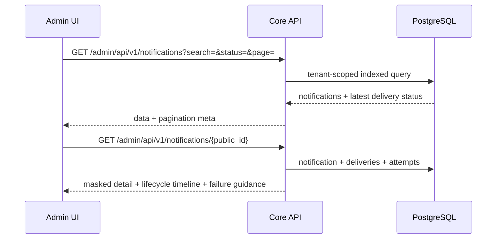

# Architecture

The platform is a modular monolith split into two deployable projects:

- `notification-core-api`: Go API and worker binaries.
- `notification-admin-ui`: React dashboard for platform and tenant users.

Shared state lives in PostgreSQL, Redis, and RabbitMQ. API processes are stateless. Queue-specific workers can be scaled independently with Docker Compose, for example `docker compose --profile all up -d --scale worker-sms=5`.

The main send path is:

1. Authenticate with JWT or tenant API key.
2. Resolve tenant and enforce tenant isolation.
3. Check `tenant_features`, `tenant_channels`, rate limits, quotas, and provider config.
4. Store notification and delivery rows.
5. Resolve the tenant/channel queue control and publish channel jobs to RabbitMQ with the deterministic queue name.
6. Workers check tenant/channel queue control status before provider delivery.
7. Workers use tenant provider config and mock providers locally.
8. Delivery attempts, audit logs, and delivery status are persisted.

The admin investigation path is:

1. Portal calls `GET /admin/api/v1/notifications` with tenant-safe filters and pagination.
2. Backend scopes the query by authenticated tenant unless the actor is a platform administrator.
3. Portal calls `GET /admin/api/v1/notifications/{public_id}` for details.
4. Backend returns masked target data, redacted JSON, delivery rows, delivery attempts, and a lifecycle timeline derived from persisted records.
5. Provider and worker errors are normalized into platform failure categories with retryability and suggested action metadata.

DB configuration decides which tenant can use a feature and whether a tenant/channel queue is active, paused, or stopped. Infrastructure sizing and worker counts still decide throughput.

